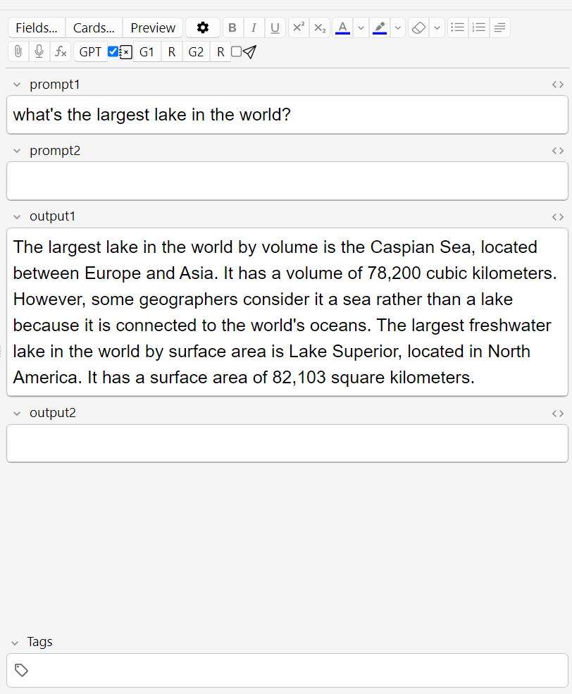

# GPT Buttons

This Anki add-on allows you to add customizable editor buttons and browser actions to fill in notes using [OpenAI](https://openai.com/)'s GPT models.

You'll need an [OpenAI API key](https://openai.com/blog/openai-api) to be able to use the add-on.

Buttons can either work on prompts pulled from configured fields (this type of buttons are called "Field buttons"),
or on prompts defined directly in the config ("Preset buttons"). You can configure multiple fields to parse the output into and other options.
All configured buttons are also accessible from the browser's _Edit > GPT_ menu for bulk operations on selected notes.

Check the add-on [config](src/config.md) under _Tools > Add-ons > Config_ for detailed description of the options.

_This add-on is currently in beta. Testing and feedback are appreciated._

## Changelog

See [CHANGELOG.md](CHANGELOG.md) for a list of changes.

## Credit

Icons are from [Bootstrap Icons](https://icons.getbootstrap.com/).

## Support & feature requests

Please post any questions, bug reports, or feature requests in the [support page](https://forums.ankiweb.net/c/add-ons/11) or the [issue tracker](https://github.com/abdnh/anki-gpt-buttons/issues).

If you want priority support for your feature/help request, I'm available for hire.
You can get in touch from the aforementioned pages, via [email](mailto:abdo@abdnh.net) or on [Fiverr](https://www.fiverr.com/abd_nh).

## Support me

Consider supporting me if you like my work:

I'm also available for freelance add-on development on Fiverr:

